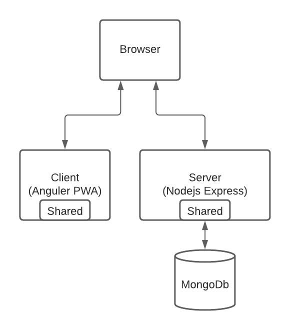

# cloudcomputing-WS20

A description of the project idea can be found in the [Proposal.md](https://github.com/LAndrosch/cloudcomputing-WS20/blob/main/Proposal.md).

## Architecure

The application consists of four parts
- [Client](https://github.com/setre-jku-cs/om-client) (Angular PWA, Frontend)
- [Server](https://github.com/setre-jku-cs/om-server) (Nodejs Express, Backend)
- [Shared](https://github.com/setre-jku-cs/om-shared) (NPM Package, shared code for client and server)
- Database (MongoDb)



## Continues Integration (GitHub-Actions)
### Execute tests

For every commit on a repository all tests are executed.

An example of the corresponding github action for the client can be seen [here](github-actions/client/run-test.yml)

### Dependency security checks with Snyk

To ensure that only dependencies are added that have no known (!) vulnerabilites an automated security check of the used dependencies was established. This check is contained in all three repositories and fails if snyk finds a vulnerable npm package. 

An example of the corresponding github action for the shared code module can be seen [here](github-actions/shared/snyk-check.yml)

`Disclaimer:` Currently the Snyk check would also fail for the om-server module as well as for the om-shared package. The reason is a dependency in the package `ts-node-dev@1.1.1` which has a known vulnerability but there is no patch available yet. As a workaround we added `continue-on-error: true` to the GitHub-Action-Workflow, which runs the test completely, but does ignore the failure to enable successful publishing in the end.  
### Check if version was increased

This test is only executed on pull request into the master branch.  
It checks that the package version was increased otherwise it fails to prevent the publishing of a newer version with an old version number.

### Publish to NPM

One of the three repositories ([Shared](https://github.com/setre-jku-cs/om-shared)) containes shared code between the client and the server. This code module is automatically published on every push on master to the NPM repository, making it automatically available on a new release. 

Due to the GitFlow guideline the GitHub-Actions publishes only if there is a new release or hotfix of the npm module (this means only if the master branch is updated).

An example of the corresponding github action for the shared code can be seen [here](github-actions/shared/npm-publish.yml)

### Publish to Docker Hub
For [Client](https://github.com/setre-jku-cs/om-client) and [Server](https://github.com/setre-jku-cs/om-server) a Docker image is created an published on every push to master.

An example of the corresponding github action for the client can be seen [here](github-actions/client/docker-push.yml)


## Gitflow

A Giflow approach was established in all three repositories. This means that there is a concrete policy that tells the developers how to publish new features and how to push source code to the repositories. 

The more concrete description is contained in a separated file: [GitFlow Policy](gitflow/gitflow.md)

Disclaimer: GitFlow is not enforced. It is seen as a guidline for the involved developers and is backed by the GitHub-Actions which only trigger on specific events (e.g. a push to master).

In addition the default branch was changed from master to `develop` to better support the Gitflow.

### Branch protection rules
The branches `master` and `develop` are also protected by the branch protection feature in Github.
- Require pull request reviews before merging
    - Require review from Code Owners
- Require status checks to pass before merging
    - Require branches to be up to date before merging
    - Status checks 
        - Tests
        - Snyk checks
        - Check version increment

They also prevent the following actions since they are not explicitly allowed.
- Force Push
- Branch deletion

## Docker

To deploy the Client and the Server on Kubernetes both are deployed in a Docker image.
- [Client](docker/client/Dockerfile)
- [Server](docker/server/Dockerfile)

## Kubernetes

To deploy the application on kubernetes a local test environment was set up with [minikube](https://minikube.sigs.k8s.io/docs/).

Minikube sets up a local Kubernetes cluster in one command.  

```bash
minikube start
```

Optionaly we can also start a kubernetes dashboard with:
```bash
minikube dashboard
```

In this cluster we can then deploy our microservices with [kubectl](https://kubernetes.io/docs/reference/kubectl/kubectl/).  

First we need to add the credentials for the database as a secret to kubernetes.  
There are 2 ways to achieve this.  

1. Provide the credentials on the command line
```bash
kubectl create secret generic mongo-secret --from-literal=username=<username> --from-literal=password=<password>
```

2. Provide the credentials from a file
```bash
kubectl create secret generic mongo-secret --from-file=username=./username.txt --from-file=password=./password.txt
```

The preffered way to provide the credentials is to use files so that they arr not stored in the terminal history.  
  
The next step is to create the persistent volume for the database.  
Since the pods have no persistant state, we would lose all data stored in the database if no persistant volume is used.  
The persistant volume is create with mongo-pv.yml, where a `PersistantVolume` and a `PersistentVolumeClaim` is created, which will later be used by the MongoDb.  

```bash
kubectl apply -f mongo-pv.yml
``` 
   
Now we can deploy the database, server and client

```bash
kubectl apply -f mongo.yml
kubectl apply -f server.yml
kubectl apply -f client.yml
```

So that the client and server is than also reachable from outside of the cluster we need to forward the following ports.
```bash
kubectl port-forward service/server 3001:3001
kubectl port-forward service/client 8080:8080
```

The UI can then be reached from `localhost:8080`.

If a horizontal auto scaler should be used there is an example in `k8s/autoscaler.yml` for the server

```bash
kubectl apply -f autoscaler.yml
```

This sets the minimum pods to 3 and max to 10 depending on the CPU utilization.